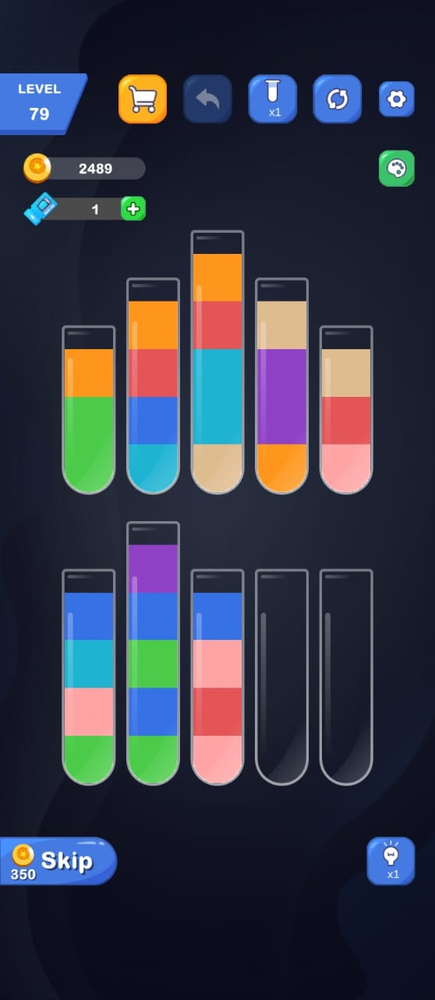

<div>
    <h1 align="center">Tube Color Detector<p align="center" dir="auto"></p></h1>
<div>

A work in progress program that takes image of bottles containing liquid of different colors and gives output as arrays containing the colors in an ordered arrangement.

### Sample Input Images

<div allign = "center">
    
</div>


### Objectives of the program

- This program is to aid in solving the puzzle game like [Color Water Sort - Puzzle](https://play.google.com/store/apps/details?id=com.FeliceCasaTechnologyPTE.LTD.WaterSortPro&hl=en_IN) .

- When the user is stuck in a level and presses the hint button, a screenshot image of that level will be stored for input(say input.jpg).

- This input.jpg will be feeded into tube-color-detect.py that will give the output as an array containing colors in an ordered manner, in maybe .json format.

- In addition, if we were to add a solving feature that solves the puzzle in the backend, we could add some algorithms that could sort the obtained arrays such that each array would contain similar colors. Since each tube is a stack,  it will follow Last In First Out(LIFO), and for sorting it seems similar to the classic algorithm problem "Towers Of Hanoi" XD.

### Prerequisites

1. `git` installed and properly setup.

2. The latest python or anaconda installed.

3. `pip` should be working.

4. You should either be on Linux or Windows.

5. You can you VScode terminal or just rawdawg it via terminal in linux.

### 📁 File Structure

- `assets/` - Contains the input for the program.

- `main.py` - Our main program.

- `requirements.txt` - The dependencies of the program.

### How to contribute to the program

Firstly clone the repo via:

```git
git clone https://github.com/jack-thesparrow/tube-color-detect.git
```

```shell
cd tube-color-detect
```

All the dependencies are installed in requirements.txt. Install them by running the following command in terminal.

```shell
pip install -r requirements.txt
```

##### Then, make a different branch for adding features, so that you dont pollute the main branch. (say the feature is a class for bottles) proceed as below.

```git
git checkout -b feature/class-bottle
```

Then do your contribution in that branch. After you complete your code and verify that it is working. You can commit  to your branch with the following commands:

```git
git add *
```

```git
git commit -m "your message of what you changed/added"
```

Then push to the branch that you created. Here it is, `feature/class-bottle`. 

```git
git push origin feature/class-bottle
```

#### Finally, create a Pull Request(PR) on github to merge to the main branch.

## IMPORTANT: Before you start the work, make sure to be in sync with the latest code commits

1. Open the tube-color-detect folder in VSCode or terminal.

2. The execute the command in terminal.
   
   `git checkout main`
   
   `git pull origin main`
